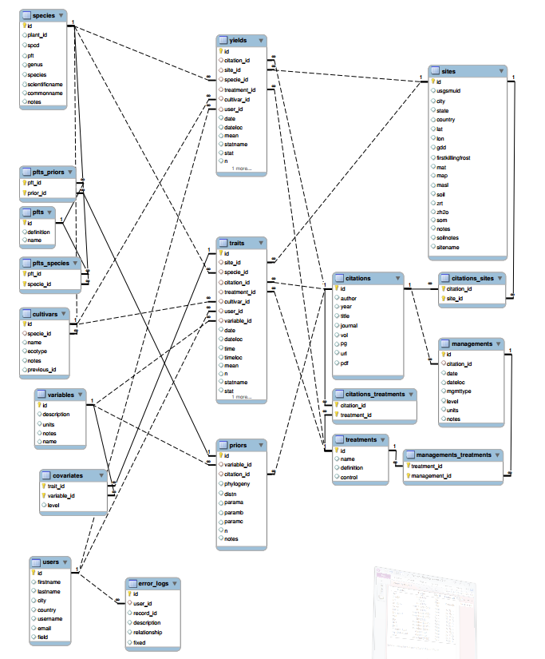

# BETYdb Tables

## Schema: Enhanced Entity-Relationship Model

**Figure 1**: Abbreviated schema for BETYdb, focusing on tables used to store plant trait and yield data. This figure excludes other tables used for PEcAn workflow system provenance and data management and for synchronizing independent instances of BETYdb across many servers. A complete and up-to-date interactive schema is published at https://www.betydb.org/schemas.

## Tables

BETYdb is designed as a relational database, somewhat normalized as shown in the structure diagram [Figure 1](#Figure-1). Each table has a primary key
field, `id`, which serves as surrogate key, a unique identifier for each row in the table.  Most tables have a natural key defined as well, by which rows can be uniquely identified by real-world attributes.
In addition, most tables have a `created_at` and an `updated_at` column to record row-insertion and update timestamps, and the
traits and yields tables each have a `user_id` field to record the user
who originally entered the data.

A complete list of tables along with short descriptions is provided in [Table 2](#Table-2), and a comprehensive
description of the contents of each table is provided below. **Note: An up-to-date list of the tables in BETYdb along with their descriptions and diagrams of their interrelationships may be found at** https://www.betydb.org/schemas.

| Table                 | Key Fields                                                                  | Contents                                                                                                                                            | Use                                                                                                                                                                  |
|-----------------------|-----------------------------------------------------------------------------|-----------------------------------------------------------------------------------------------------------------------------------------------------|----------------------------------------------------------------------------------------------------------------------------------------------------------------------|
| Traits, Yields        | mean, n, variance estimate, date, time, site, citation, species, treatment  | Trait, yield, and ecosystem service data, including values and summary statistics.                                                                  | Stores primary,data                                                                                                                                                  |
| Variables             | name, definition, units                                                     | Definitions, description, units, and allowable ranges of specific traits and ecosystem,services contained in the database                           | Defines primary,data, covariates, and priors                                                                                                                         |
| Covariates            | variable, level                                                             | Context required to interpret a particular data point—for example the time, temperature, or location of a measurement                               | Contextual information necessary to interpret data                                                                                                                   |
| Plant Functional Type | name, definition, reference                                                 | Context required to interpret a particular data point—for example the time, temperature, or location of a measurement                               | Data synthesis, QA/QC                                                                                                                                                |
| Species               | scientific name                                                             | USDA Plants database, amended with additional species and links to other tables within BETYdb                                                       |                                                                                                                                                                      |
| Cultivars             | species, name, citation                                                     | Specific genotype bred for cultivation                                                                                                              |                                                                                                                                                                      |
| Priors                | variable, citation, phylogeny, distribution                                 | Probability distributions that quantify knowledge of a variable in the absence of information at the level of functional type, species, or cultivar | Stores expert knowledge; used in QA/QC and data analysis                                                                                                             |
| Treatments            | name, definition                                                            | Qualitative descriptions of treatments described in the primary publication                                                                         | Categorize experimental treatments; permits reference to original publication                                                                                        |
| Managements           | date, citation, type, level, units                                          | Quantitative record of management activities performed on all plots or specific experimental interventions                                          |                                                                                                                                                                      |
| Sites                 | name, latitude, longitude                                                   | Location and basic climate and soil information                                                                                                     |                                                                                                                                                                      |
| Citations             | author, year, title, DOI                                                    | Unique reference for source of information, not necessarily published                                                                               | Used in many tables to independently record source of information that may come from multiple publications                                                           |
| Entities              | parent, name                                                                | Links related trait records                                                                                                                         | Used to identify measurments made on the same unit of replication (e. g. leaf, plant, or plot) when information is available; used to "pivot" data from long to wide. |

Table: Table 2

## Table and field naming conventions

Each table is given a name that describes the information that it
contains. For example, the table containing trait data is called
"traits", the table containing yield data is "yields", and so on. Each
table also has a *primary key*; the primary key is always "id", and the
primary key of a specific table might be identified as "yields.id" . One
table can reference another table using a *foreign key*; the foreign key
is given a name using the singular form of the foreign table, an
underscore, and "id", e. g. "trait_id" or "yield_id".

In some cases, two tables can have multiple references to one another,
known as a "many to many" or "m:n" relationship. For example, one
citation may contain data from many sites; at the same time, data from a
single site may be included in multiple citations. Such relationships
use join tables (also known as "association tables" or "junction tables"). Join tables (e.g. [Table 4](#Table-4), [Table 5](#Table-5), [Table 10](#Table-10), [Table 12](#Table-12), [Table 13](#Table-13))
combine the names of the two tables being related. For
example, the table used to link `citations` and `sites` is named
`citations_sites`. These join tables have two foreign keys (`citation_id` and `site_id` in this example) which together uniquely identify a row of the table (and thus constitute a _candidate key_).  (For various implementational reasons, these tables also have a surrogate key named `id`, but in general such a key is extraneous.)

While foreign key columns are identified implicitly by the naming convention whereby such columns end with the suffix `_id`, foreign keys can be made explicit by imposing a _foreign-key constraint_ at the database level.  Such a constraint identifies the table and column which the foreign key refers to and in addition guaranties that a row with the required value exists.  Thus, if there is a foreign-key constraint saying that the column `yields.citation_id` refers to `citations.id`, then if there is a row in the yields table where `cititation_id = 9`, there must also be a row in the citations table where `id = 9`.  Explicit foreign keys show up in the [schema](https://www.betydb.org/schemas) documentation as an entry in the _References_ column of the table listing and as a line between tables in the schema diagrams.

### Data Tables

The two data tables, **traits** and **yields**, contain the primary data
of interest; all of the other tables provide information associated with
these data points. These two tables are structurally very similar as can
be seen in [Table 17](#Table-17) and [Table 20](#Table-20).

#### traits

The **traits** table contains trait data ([Table 17](#Table-17)). Traits are measurable
phenotypes that are influenced by a plant's genotype and environment.
Most trait records presently in BETYdb describe tissue chemistry,
photosynthetic parameters, and carbon allocation by plants.

#### yields

The **yields** table includes aboveground biomass in units of Mg per
ha ([Table 20](#Table-20)). Biomass harvested in the fall and winter generally
represents what a farmer would harvest, whereas spring and summer
harvests are generally from small samples used to monitor the progress
of a crop over the course of the growing season. Managements associated
with yields can be used to determine the age of a crop, the
fertilization history, the harvest history, and other useful information.

### Auxillary Tables

#### sites

Each site is described in the **sites** table ([Table 15](#Table-15)). A site can have
multiple studies and multiple treatments. Sites are identified and
should be used as the unit of spatial replication; treatments are used to
identify independent units within a site, and these can be compared to
other studies at the same site with shared management. "Studies" are
not identified explicitly, but independent studies can be identified via
shared management entries at the same site.

#### treatments

The **treatments** table provides a categorical identifier of a study’s
experimental treatments, if any ([Table 18](#Table-18)).

Any specific information such as rate of fertilizer application should
be recorded in the managements table. A treatment name is used
as a categorical (rather than continuous) variable, and the name relates
directly to the nomenclature used in the original citation. The
treatment name does not have to indicate the level of treatment used in
a particular treatment; if required for analysis, this information is
recorded as a management.

Each study includes a control treatment; when there is no experimental
manipulation, the treatment is considered "observational" and listed as
"control". In studies that compare plant traits or yields across different
genotypes, site locations, or other factors that are built in to the
database, each record is associated with a separate cultivar or site so
these are not considered treatments.

For ambiguous cases, the control treatment is assigned to the treatment
that best approximates the background condition of the system in its
non-experimental state; for this reason, a treatment that approximates
conventional agronomic practice may be labeled "control".

#### managements

The **managements** table provides information on management types,
including planting time and methods, stand age, fertilization,
irrigation, herbicides, pesticides, as well as harvest method, time and
frequency.

The **managements** and **treatments** tables are linked through the
`managements_treatments` table ([Table 10](#Table-10)).

Managements are distinct from treatments in that a management is used to
describe the agronomic or experimental intervention that occurs at a
specific time and may have a quantity whereas _treatment_ is a categorical
identifier of an experimental group. Managements include actions that
are done to a plant or ecosystem—for example the planting density or
rate of fertilizer application.

In other words, managements are the way a treatment becomes quantified.
Each treatment can be associated with multiple managements. The
combination of managements associated with a particular treatment will
distinguish it from other treatments. Each management may be associated
with one or more treatments. For example, in a fertilization experiment,
planting, irrigation, and herbicide managements would be applied to all
plots but the fertilization will be specific to a treatment. For a
multi-year experiment, there may be multiple entries for the same type
of management, reflecting, for example, repeated applications of
herbicide or fertilizer.

#### covariates

The **covariates** table is used to record one or more covariates
associated with each trait record ([Table 6](#Table-6)). Covariates generally indicate the
environmental or experimental conditions under which a measurement was
made. The definition of specific covariates can be found in the
**variables** table ([Table 19](#Table-19)). Covariates are required for many of the traits
because without covariate information, the trait data will have limited
value.

The most frequently used covariate is the temperature at which some
respiration rate or photosynthetic parameter was measured. For example,
photosynthesis measurements are often recorded along with irradiance,
temperature, and relative humidity.

Other covariates include the size or age of the plant or plant part
being measured. For example, root respiration is usually measured on
fine roots, and if the authors define fine root as < 2mm, the covariate
`root_diameter_max` has a value of 2.

#### pfts

The plant functional type (PFT) table **pfts** is used to group plants for
statistical modeling and analysis. Each row in **pfts** contains a PFT that is
linked to a set of species in the **species** table.  This relationship requires
the lookup table **pfts\_species** ([Table 13](#Table-13)).  Alternatively, a
PFT may be linked to a set of cultivars in the **cultivars** table via the
**cultivars\_pfts** lookup table.  (A PFT can not comprise both cultivars and
species.)  Furthermore, each PFT can be associated with a set of trait prior
probability distributions in the **priors** table ([Table 14](#Table-14)). This
relationship requires the lookup table **pfts\_priors** ([Table 12](#Table-12)).

In many cases, it is appropriate to use a pre-defined default PFT (for example
`tempdecid` is temperate deciduous trees). In other cases, a user can
define a new PFT to query a specific set of priors or subset of species.
For example, there is a PFT for each of the functional types found at
the EBI Farm prairie. Such project-specific PFTs can be named using the binomial scheme
_projectname_._pftname_—for example, `ebifarm.c4grass` instead of simply `c4grass`.

#### variables

The **variables** table includes definitions of different variables used
in the traits, covariates, and priors tables ([Table 19](#Table-19)). Each variable has a
`name` field and is associated with a standardized value for `units`.
The `description` field provides additional information or context about
the variable.

### Join Tables

Join tables are required when each row in one table may be related
to many rows in another table and vice-versa; this is called a "many-to-many" relationship.

#### citations\_sites

Because a single study may use multiple sites and multiple studies may
use the same site, these relationships are tracked in the
**citation\_sites** table ([Table 4](#Table-4)).

#### citations\_treatments

Because a single study may include multiple treatments and each
treatment may be associated with multiple citations, these relationships
are recorded in the **citations\_treatments** table ([Table 5](#Table-5)).

#### cultivars\_pfts

The **cultivars\_pfts** table allows a many-to-many relationship between the
**pfts** and **cultivars** tables.  A PFT that is related to a set of cultivars
may not also be related to one or more species (except indirectly, by virtue of its associated cultivars belonging to particular species).  A database-level constraint
ensures this.

#### managements\_treatments

It is clear that one treatment may have many managements, e. g. tillage,
planting, fertilization. It is also important to note that any
managements applied to a control plot should, by definition, be
associated with all of the treatments in an experiment; this is why the
many-to-many association table **managements\_treatments** is required.

#### pfts\_priors

The **pfts\_priors** table allows a many-to-many relationship between
the **pfts** and **priors** tables ([Table 12](#Table-12)). This allows each pft to be
associated with multiple priors and each prior to be associated with
multiple pfts.

#### pfts\_species

The **pfts\_species** table allows a many-to-many relationship between the
**pfts** and **species** tables ([Table 13](#Table-13)).  A PFT that is related
to a set of species may not also be related to one or more cultivars (except
perhaps indirectly, by virtue of the associated species having certain
cultivars). A database-level constraint ensures this.

